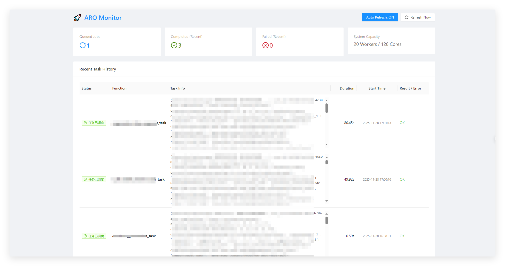

# 🚀 ARQ Dashboard

> A lightweight, real-time monitoring dashboard for Python [ARQ](https://github.com/python-arq/arq) task queues.

[](https://www.python.org/)
[](https://fastapi.tiangolo.com/)
[](LICENSE)

**ARQ Dashboard** is a standalone visualization tool designed for developers using `arq` with Redis. It provides a clear overview of your background jobs without requiring complex setups like Prometheus or Grafana. It reads directly from Redis, parsing ARQ's compressed data structures to display task status, execution time, and results.


*(Add a screenshot of your dashboard here to show how it looks)*

## ✨ Features

- **Real-time Monitoring**: View the count of queued jobs instantly.
- **Job History**: Track recent job executions, including success, failure, and retries.
- **Detailed Insights**:
  - Visualize Job ID, Function Name, and Arguments.
  - Precise timestamp parsing (Enqueued, Started, Finished).
  - Automatic duration calculation (e.g., `2.54s`).
- **Error Visualization**: One-click view for traceback and error details on failed jobs.
- **Zero Database Dependency**: Reads directly from your existing Redis instance.
- **Lightweight**: Built with FastAPI and a single-file React frontend (no build step required).

## 🛠 Prerequisites

- Python 3.8+
- A running Redis instance (used by your ARQ workers)
- Your existing ARQ worker codebase (optional, but recommended for unpickling custom classes)

## 📦 Installation

1. **Clone the repository**
   ```bash
   git clone [https://github.com/your-username/arq-dashboard.git](https://github.com/your-username/arq-dashboard.git)
   cd arq-dashboard
    ```

2. **Install dependencies**
    ```bash
    pip install -r requirements.txt
    ```
    *(Create a requirements.txt with: `fastapi`, `uvicorn`, `redis`, `arq`, `pydantic`)*

## ⚙️ Configuration

Open `monitor.py` and configure your Redis connection settings at the top of the file:

```python
# monitor.py

REDIS_SETTINGS = {
    "host": "localhost",  # Or 'host.docker.internal' if running in Docker
    "port": 6379,
    "password": "your_password",
    "db": 0
}
```

> **Note on Custom Classes**: ARQ uses `pickle` to serialize job data. If your jobs use custom Python classes as arguments or return values, ensure `monitor.py` can import your project code. The script includes `sys.path.append` logic to help with this.

## 🚀 Usage

Run the dashboard server:

```bash
python monitor.py
```

The server will start on port **8999**.

Open your browser and visit:
👉 **http://localhost:8999**


## 🧩 Project Structure

```text
arq_dashboard
├── monitor.py          # FastAPI backend & Redis logic
├── static/
│   └── index.html      # React frontend (Single File Component)
├── requirements.txt    # Python dependencies
└── README.md           # Documentation
```

## ❓ Troubleshooting

**Q: I see "ImportError: No module named 'app'" in the logs.**
A: This happens because ARQ is trying to unpickle an object defined in your main application. Ensure your project root is in the Python path, or place `monitor.py` in a location where it can import your app's modules.

**Q: Timestamps look wrong or missing.**
A: The dashboard automatically handles ARQ's raw timestamps (milliseconds integers). If you use a custom time format, you may need to adjust the `parse_timestamp` function in `monitor.py`.

## 🤝 Contributing

Contributions are welcome\! Please feel free to submit a Pull Request.

1.  Fork the project
2.  Create your feature branch (`git checkout -b feature/AmazingFeature`)
3.  Commit your changes (`git commit -m 'Add some AmazingFeature'`)
4.  Push to the branch (`git push origin feature/AmazingFeature`)
5.  Open a Pull Request

## 📄 License

Distributed under the MIT License. See `LICENSE` for more information.